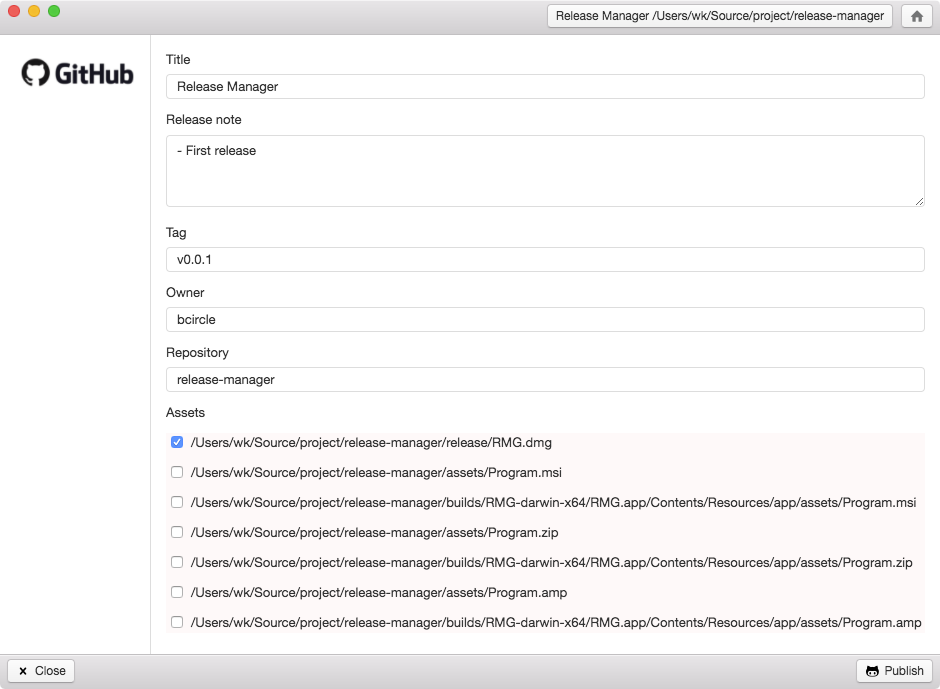

## Release Manager



### Requirement

- `GITHUB_TOKEN` in system environment.

### Usage

1. Install `RMG.dmg`
2. Open Terminal
3. Type `/Applications/ghr.app/Contents/MacOS/ghr`
4. Enter release information.
5. Click `Publish`

### Development mode

To start the Figwheel compiler, navigate to the project folder and run the following command in the terminal:

```
lein figwheel
```

Figwheel will automatically push cljs changes to the browser.
Once Figwheel starts up, you should be able to open the `public/index.html` page in the browser.


### Building for production

```
lein clean
lein package
```
